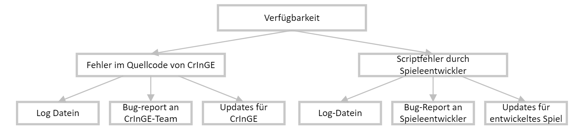
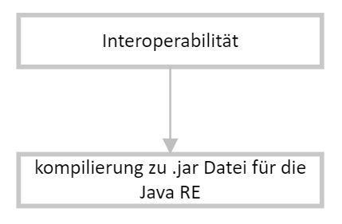
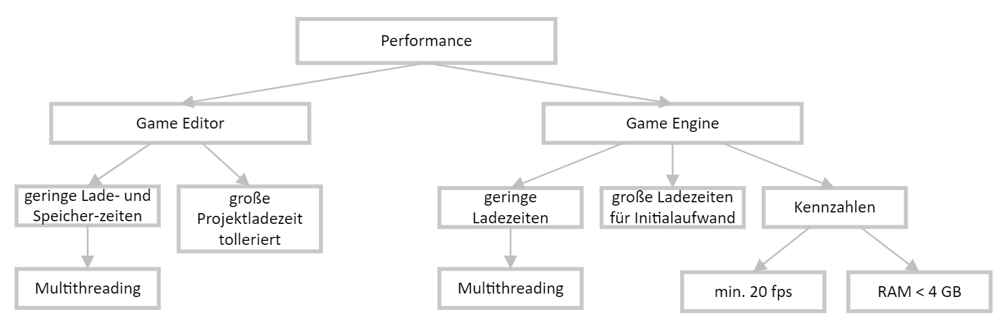
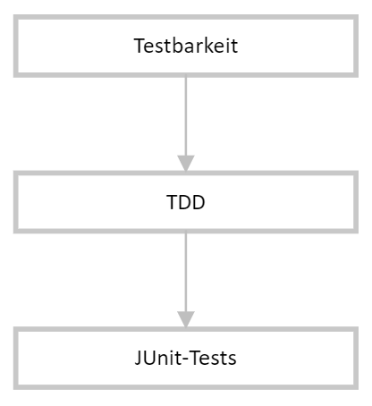

# CrInGE - Architektonische Anforderungen

## 1. Einleitung

Dieses Dokument beschreibt die Softwarearchitektur und alle daraus entstehenden Anforderungen für die Anwendung "CrInGE".

### 1.1 Übersicht

Um die Softwarearchitektur der Videospielengine "CrInGE" und des dazugehörigen Videospieleditors klar zu definieren und festzuhalten, sollen in diesem Dokument alle relevanten Anforderungen an die zugehörige Softwarearchitektur zentral dokumentiert werden. Damit soll sichergestellt werden, dass die Entwicklung der Software stringent den dokumentierten Anforderungen genügt und eine Software entsprechender Qualität produziert wird.

### 1.2 Geltungsbereich

Dieses Dokument beschreibt alle Anforderungen für die Anwendung "CrInGE". Dies beinhaltet sowohl alle Anforderungen an die Videospielengine, als auch an den Videospieleditor.

Sollte dies notwendig sein, können Subsysteme zukünftig mit ihren eigenen architektonischen Anforderungen ausgestattet werden. Dies wird dann in diesem Dokument entsprechend gekennzeichnet. Aktuell ist dies jedoch nicht geplant.

### 1.3 Definitionen, Akronyme und Abkürzungen

Im Nachfolgenden folgt eine List aller Definitionen, Akronyme und Abkürzungen, die im Weiteren Verlauf dieses Dokumentes verwendet werden.

<!-- Bitte beachten: Die Einträge in dieser Tabelle sollen alphabetisch (nach dem Akronym) sortiert werden! -->
Akronym | Bedeutung
--- | ---
API | <ins>A</ins>pplication <ins>P</ins>rogrammer <ins>I</ins>nterface (Deutsch: Programmierschnittstelle)
ASR | <ins>A</ins>rchitecutrally <ins>s</ins>ignificant <ins>r</ins>equirements
CrInGE | <ins>C</ins>ompute<ins>r</ins>ized <ins>In</ins>tegrated <ins>G</ins>ame <ins>E</ins>ngine
FPS | <ins>F</ins>rames <ins>p</ins>er <ins>s</ins>econd
MVC | <ins>M</ins>odel-<ins>V</ins>iew-<ins>C</ins>ontroller

### 1.4 Referenzen

Im Nachfolgenden folgt eine Liste aller Referenzen, die im weiteren Verlauf dieses Dokumentes verwendet werden.

<!-- Bitte beachten: Die Einträge in dieser Tabelle sollen nach dem Veröffentlichungsdatum sortiert werden! -->
Titel | Datum | Veröffentlichungsorganisation | Link
--- | --: | --- | ---
CrInGE Logo | 01.11.2023 | CrInGE Entwicklungsteam | [CrInGE Logo](./resources/img/logo.png)

## 2. Architektonische Darstellung

Dieses Projekt verwendet das MVC-Entwurfsmuster sowohl für den Videospieleditor, als auch für die Videospielengine. Beide genannten Bestandteile des Projektes werden mit Java Swing entwickelt, weshalb sich dieses Entwurfsmuster anbietet.

Darüber Hinaus ermöglicht das MVC-Entwurfsmuster eine saubere und übersichtliche Trennung der Geschäftslogik und der Darstellung. Hierdurch kann übersichtlicherer Quellcode entstehen, was die Entwicklung und Weiterentwicklung der Anwendung erleichtert.

## 3. Qualitätsmerkmale

Um eine entsprechend hohe Softwarequalität zu wahren, wurden einige Qualitätsmerkmale festgestellt. Diese sollen bei der Entwicklung der Software konsequent berücksichtigt werden.

Qualitätserkmale beziehen sich sowohl auf den Videospieleditor, deren Benutzer im Nachfolgenden als _Videospielentwickler_ bezeichnet werden, als auch auf die Videospielengine, deren Benutzer im Nachfolgenden als _Videospieler_ bezeichnet werden.

### 3.1 Verfügbarkeit

Sowohl Videospielengine, als auch Videospieleditor werden durch dieses Projekt entwickelt. Fehler im Quellcode dieser Bestandteile können demnach sowohl zu Ausfällen beim Videospielentwickler, als auch beim Videospieler führen.

Fehler innerhalb des Quellcodes der Engine und des Editors können ausschließlich durch Softwareupdates durch das CrInGE Entwicklungsteam behoben werden. Hierzu sind Bug-Reports durch die Benutzer nötig. Das Bearbeiten solcher Bug-Reports ist unter Umständen mit einem erheblichen Zeitaufwand verbunden. Um diesen Zeitaufwand zu verringern, können Fehler weitmöglichst mittels geeigneter Methoden (bspw. `try-catch`) abgefangen und in Log-Dateien geschrieben werden. Solche Log-Dateien können dann zur Behebung des Fehlers eingereicht werden, sodass die benötigte Zeit zum Identifizieren und Replizieren von Fehlern verringert wird. So kann letztlich eine möglichst geringe Ausfallzeit sichergestellt werden.

Fehler, die in entwickelte Videospiele durch den Videospielentwickler eingeführt werden, können durch das CrInGE Entwicklungsteam nicht behoben werden. Auftretende Fehler können aber auf dieselbe Weise wie zuvor beschrieben in Log-Dateien dokumentiert werden. Videospieler können dann beim Auftreten von Fehlern diese Log-Dateien beim Videospielentwickler einreichen.

    

### 3.2 Interoperabilität

Die Engine verarbeitet weitgehen Daten, die durch den Editor erstellt wurden. Hierzu gehören beispielsweise Map-Dateien oder Assets. Beim Exportieren des Videospiels müssen diese Daten in korrekte Dateiformate überführt werden, damit diese von der Engine verwendet werden können.

Die von der Engine erstellten Dateien müssen korrekt sein. Dazu muss die Engine dies bei jedem Zugriff auf die Dateien überprüfen. Wenn die Dateien nicht korrekt sind, kann das Videospiel nicht ausgeführt werden.

Vom Videospielentwickler erstellte Skripte müssen ebenfalls auf Korrektheit überprüft werden. Diese Skripe werden in der Programmiersprache Java entwickelt und beim Exportieren des Videospiels durch den Java Kompiler kompiliert. Dadurch werden die Skripte in die Jar-Datei, die das entwickelte Videospiel darstellt, eingebunden. Treten beim Kompilieren des Spiels keine Fehler auf, ist davon auszugehen, dass die Skripte korrekt sind. Treten beim Ausführen solcher Skripte Laifzeitfehler auf, so können diese abgefangen und in Log-Dateien dokumentiert werden. Hierbei handelt es sich dann um Fehler, die durch den Videospielentwickler eingeführt werden (siehe [3.1 Verfügbarkeit](#31-verfügbarkeit)).

    

### 3.3 Änderbarkeit

Sowohl Editor als auch Engine sollen durch zukünftige Softwareupdates um Funktionen erweitert werden können. Dabei soll möglichst kein hoher Mehraufwand entstehen.

Um dies sicherzustellen, müssen potenzielle Änderungen vorhergesehen werden. Die bestehende Software darf solchen Änderungen keine Hindernisse "in den Weg legen".

Dies ist jedoch sehr aufwendig, da ein hoher Planungsaufwand notwendig wäre um eine große Anzahl potenzieller zukünftiger Änderungen vorherzusehen. Aus diesem Grund beschränkt sich das Entwicklungsteam darauf, alle bisher ausgearbeiteten Funktionen wie sie in der [Software Anforderungsspezifikation](./SoftwareAnforderungsspezifikation.md#2-funktionale-anforderungen) aufgeführt werden, wie erläutert zu behandeln.

### 3.4 Performance

Damit unsere Software eine attraktive Alternative zu bestehenden Angeboten darstellt, ist eine entsprechende Performance notwendig.

Videospielentwicklern muss das Entwickeln von Videospielen ohne größere Umstände ermöglicht werden. Dazu sollen Wartezeiten während der Entwicklung von Videospielen möglichst gering gehalten werden. Ladezeiten von Dateien (beispielsweise Map-Dateien) sollen den Videospielentwickler nicht negativ beeinträchtigen. Dies gilt ebenfalls für Schreiboperationen zum Ändern von Dateien. Insgesamt sollen derartig Operationen nie länger als wenige Sekunden dauern. Dieser Maßstab wird ebenfalls beibehalten, wenn mehrere Dateien zeitgleich geladen werden müssen. Idealerweise werden derartige aufwändige Operationen auf Prozesse oder Threads ausgelagert, um eine flüssigere Benutzererfahrung zu ermöglichen. Ausgenommen hiervon sind aufwendige Lese- und Schreiboperationen zum Öffnen oder Schließen eines Projektes durch den Videospielentwickler, da die dabei zu betrachtende Datenmenge nicht in wenigen Sekunden bearbeitet werden kann.

Ladezeiten sollen in der Engine ebenfalls gering sein. Hier bietet sich derselbe Maßstab, wie oben beschrieben, an. Darüber Hinaus gibt es einige Kennzahlen, die von Videospielern häufig gesondert betrachtet werden. Solche Kennzahlen müssen von der Engine attraktiv gestaltet werden, sodass Videospieler eine angenehme Erfahrung mit Videospielen dieser Anwendung haben. Eine besonders wichtige Kennzahl ist durch die sogenannten FPS gegeben. Um den Videospieler zufriedenzustellen, sollen entwickelte Videospiele mit mehr als 20 FPS ausgeführt werden. Darüber Hinaus soll die Engine den Arbeitsspeicher des Videospielers mit nicht mehr als 4 GB belasten.

Diese Kennzahlen sind selbstverständlich stark vom ausführenden Endgerät abhängig, jedoch wurden sie zur Orientierung des CrInGE Entwicklungsteam genau beziffert aufgenommen.

    

### 3.5 Sicherheit

Die vom Videospieleditor erzeugten Dateien dürfen nicht von Unbefugten bearbeitet werden, sodass deren Integrität fortlaufend gewahrt wird. Des Weiteren müssen diese Daten dem Editor jederzeit zur Verfügung stehen. Dies gilt ebenfalls für die Engine.

Während der Entwicklung eines Videospiels liegen entsprechende Dateien hauptsächlich in einem Projektverzeichnis vor. Hier ist der Schutz vor Unbefugten nur schwer umzusetzen. Es wäre möglich die Dateien zu signieren, jedoch sind hierfür zertifizierte Signaturschlüssel notwendig. Des Weiteren dürfte eine solche Signatur nicht auf dem Endgerät des Videospielentwicklers durchgeführt werden, damit bei einer Dekompilierung des Editors der Signaturschlüssel nicht kompromittiert wird. Hierfür wäre also eine seperate Serverinfrastruktur notwendig, was einen erheblichen Aufwand erzeugen würde. Daher werden die Daten zur Videospielentwicklung nicht weiter vor unbefugten Zugriff geschützt.

Die Videospielengine greift hauptsächlich auf Dateien zu, die den Resources der entsprechenden Jar-Datei zugeordnet sind. Der Zugriff auf solche Datein ist zwar mit einem geringen Mehraufwand verbunden, jedoch sollte hierdurch verhindert werden, dass der Videospieler versehentlich Änderungen an diesen Dateien vornimmt.

Von besonderer Bedeutung sind die vom Videospielentwickler entwickelten Skripte. Da diese in Java programmiert werden, können mittels solcher Skripte erhebliche Schäden auf dem Endgerät des Videospielers erzeugt werden. Dies kann durch diese Anwendung zwar nicht verhindert werden, jedoch muss ebenfalls in Betracht gezogen werden, dass nach Kompilierung des Videospiles solche Skripte durch Unbefugte bearbeitet werden. Hierdurch könnte beispielsweise Malware auf dem Endgerät des Videospielers ausgeführt werden. Dem wird entgegengewirkt, indem die Skripte ausschließlich in kompilierter Form in der Jar-Datei aufgenommen werden. Es wäre zwar durch Dekompilierung möglich, den ursprünglichen Skript wiederherzustellen, jedoch könnte der Videospielentwickler durch Bereitstellen von Prüfsummen oder Signaturen sicherstellen, dass das entwickelte Videospiel nicht von Unbefugten bearbeitet wurde, bevor es auf dem Endgerät des Videospielers ausgeführt wird. Dies ist jedoch vom Videospielentwickler abhängig, sodass das CrInGE Entwicklungsteam keinen Einfluss darauf hat.

### 3.6 Testbarkeit

Zur Verinngerung von Ausfallzeiten und der Maximierung der [Verfügbarkeit](#31-verfügbarkeit) wird die Anwendung Test-Driven entwickelt. Dies beinhaltet sowohl die Engine, als auch den Editor. Hierdurch werden mögliche Fehler und Bugs frühzeitig in der Entwicklung erkannt, was den Aufwand zur Behebung solcher Probleme stark verringert.

Es ist Anzunehmen, dass zwischen 30 % und 50 % des entstehenden Arbeitsaufwands zum Testen der Anwendung anfällt. Diese Schätzung basiert sowohl auf bisheriger Erfahrung des CrInGE Entwicklungsteams, als auch auf Berichten anderer Softwareentwicklungshäuser.

Insgesamt können die meisten Komponenten durch Unit-Tests mittels JUnit abgedeckt werden, wodurch die Fehleranzahl stark sinkt.

    

### 3.7 Benutzbarkeit

Damit die Anwendung als konkurrenzfähiges Produkt angesehen wird, muss sowohl Engine als auch Editor benutzbar und Benutzerfreundlich gestaltet sein.

Für die Videospielengine ist dies von geringerer Bedeutung, da diese ausschließlich in Videospielen verwendet wird, die durch den zugehörigen CrInGE-Editor erzeugt werden. Daher sind für sowohl Videospielentwickler als auch Videospieler die inneren Funktionsweisen der Engine nicht weiter beachtenswert.

Für den Editor ergeben sich im Sinne der Benutzbarkeit jedoch einige Maßstäbe, die zu beachten sind. Beispielsweise sollen gängige Tastenkürzel verwendet werden, wie `STRG + C`, `STRG + V` oder `STRG + S`, die in anderer (unter Umständen vergleichbarer) Software auffindbar sind. Hierdurch wird sichergestellt, dass der Videospielentwickler intuitiv den Editor verwenden kann.

Des Weiteren sollen gängige Designprinzipien beachtet werden. Beispielsweise soll es eine Menüleiste am oberen Bildschirmrand geben. Die Menüs sollen dabei vergleichbar zu anderer Software aufgebaut werden. Eine Einteilung in "Datei", "Bearbeiten", "Build", usw. wäre hierbei denkbar. Solche Menüaufteilungen sind dem Videospielentwickler bereits aus anderen Anwendungen bekannt, wodurch der Editor benutzerfreundlicher wird.

Insgesamt ist die Benutzerfreundlichkeit und die Benutzbarkeit - nicht zuletzt aufgrund der Komplexität der entstehenden Anwendung - nur schwer messbar.

    

