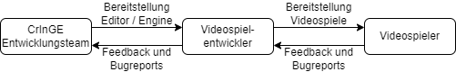
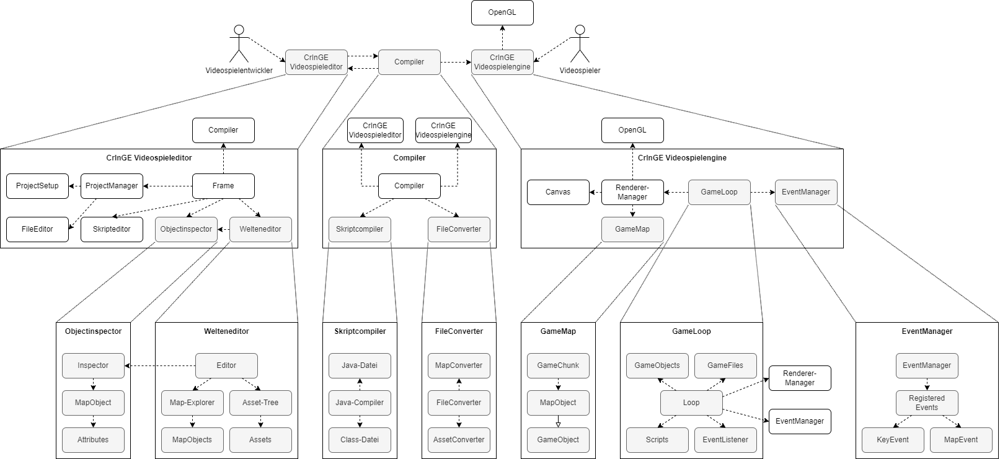
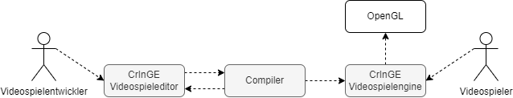
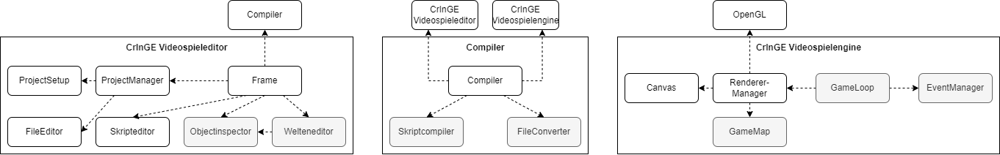
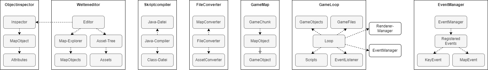

# CrInGE - Momentane Softwarearchitektur

## Inhaltsverzeichnis

1. [Einführung und Ziele](#1-einführung-und-ziele)
2. [Randbedingungen](#2-randbedingungen)
3. [Kontextabgrenzung](#3-kontextabgrenzung)
4. [Lösungsstrategie](#4-lösungsstrategie)
5. [Bausteinsicht](#5-bausteinsicht)
6. [Laufzeitsicht](#6-laufzeitsicht)
7. [Verteilungssicht](#7-verteilungssicht)
8. [Querschnittliche Konzepte](#8-querschnittliche-konzepte)
9. [Architekturentscheidungen](#9-architekturentscheidungen)
10. [Qualitätsanforderungen](#10-qualitätsanforderungen)
11. [Risiken und technische Schulden](#11-risiken-und-technische-schulden)
12. [Glossar](#12-glossar)

## 1. Einführung und Ziele

Um die Softwarearchitektur der Videospielengine "CrInGE" und des dazugehörigen Videospieleditors klar zu definieren und festzuhalten, sollen in diesem Dokument alle relevanten Anforderungen an die zugehörige Softwarearchitektur zentral dokumentiert werden. Damit soll sichergestellt werden, dass die Entwicklung der Software stringent den dokumentierten Anforderungen genügt und eine Software entsprechender Qualität produziert wird.

### 1.1 Aufgabenstellung

Es soll eine Videospielengine und ein dezugehöriger Videospieleditor entwickelt werden. Hiermit soll die Hürde für neueinsteigende Videospielentwickler gesenkt werden. Daher soll der Videospieleditor  einfache zweidimensionale Videospiele entwickeln können. Der Benutzer soll den Videospieleditor dabei intuitiv und ohne große Probleme benutzen können. Einige grundlegende Bestandteile von Videospielen sollen dem Benutzer zur vereinfachten Benutzbarkeit bereitgestellt werden. Weitere Anforderungen an die Software werden in der [Software Anforderungsspezifikation](./SoftwareAnforderungsspezifikation.md) dokumentiert.

### 1.2 Qualitätsziele

Um eine Software entsprechend hoher Qualität zu entwickeln, sollen einige zentrale Qualitätsmerkmale durchgehend beachtet werden.

Ein zentrales zu beachtendes Qualitätsmerkmal ist die [Änderbarkeit](#103-änderbarkeit). Hiermit ist gemeint, dass zukünftig neue Funktionen in die Software eingebaut werden können, ohne dass dabei ein hoher Aufwand durch bestehenden Quellcode entsteht. Mit anderen Worten soll bestehender Quellcode zukünftigen Änderungen "nicht im Weg stehen". Dadurch sollen zukünftige Kosten und zukünftiger Aufwand minimiert werden.

Als weiteres dringlichst zu beachtendes Qualitätsmerkmal kann die [Testbarkeit](#106-testbarkeit) angeführt werden. Hiermit ist gemeint, dass die Software Test-Driven entwickelt wird, damit Fehler und Probleme frühzeitig erkannt werden, wodurch zukünftige Aufwände und Kosten minimiert werden.

Das dritte Qualitätsmerkmal ist die [Benutzbarkeit](#107-benutzbarkeit). Hiermit ist gemeint, dass die Software so entwickelt wird, dass diese vom Endbenutzer einfach bedient werden kann. Dies ist wichtig, damit die Videospielengine und der dazugehörige Videospieleditor als konkurrenzfähige und attraktive Alternative zu bestehenden Angeboten wahrgenommen werden. Dies ist besonders aufmerksam bei der Entwicklung des Videospieleditors zu beachten.

Dies sind die grundlegenden Qualitätsmerkmale. Alle weiteren Qualitätsmerkmale sind [hier](#10-qualitätsanforderungen) zu finden.

### 1.3 Stakeholder

Es folgt eine Liste sämtlicher Stakeholder des Projektes.

Rolle | Erwartungshaltung
--- | ---
Herr Harald Ichters | Als Dozent möchte Herr Harald Ichters, dass den Aufgaben unter Beachtung des Aspektes des Software Engineerings pflichtbewusst und zielgerichtet im jeweiligen Zeitrahmen nachgegangen wird.
CrInGE Entwicklungsteam | Das Entwicklungsteam der Software möchte, dass die Software gemäß einer hohen Qualität entwickelt wird. Des Weiteren möchte das Entwicklungsteam stetig Neues lernen.

### 1.4 Definitionen, Akronyme und Abkürzungen

Eine Liste aller Definitionen, Akronymen und Abkürzungen, die im Weiteren Verlauf dieses Dokumentes verwendet werden, ist im [Glossar](#12-glossar) zu finden.

### 1.5 Referenzen

Im Nachfolgenden folgt eine Liste aller Referenzen, die im weiteren Verlauf dieses Dokumentes verwendet werden.

<!-- Bitte beachten: Die Einträge in dieser Tabelle sollen nach dem Veröffentlichungsdatum sortiert werden! -->
Titel | Datum | Veröffentlichungsorganisation | Link
--- | --: | --- | ---
CrInGE Logo | 01.11.2023 | CrInGE Entwicklungsteam | [CrInGE Logo](./resources/img/logo.png)
| Oberste Ebene Sequenzdiagramm | 05.12.2023 | CrInGE Entwicklungsteam | [Oberste Ebene Sequenzdiagramm](./resources/UML/asr/Kapitel%206/SequenzDiagrammObersteEbene.png)
| Game Engine Sequenzdiagramm | 05.12.2023 | CrInGE Entwicklungsteam | [Game Engine Sequenzdiagramm](./resources/UML/asr/Kapitel%206/SequenzdiagrammGameEngine.png)
| Projekt Sequenzdiagramm | 05.12.2023 | CrInGE Entwicklungsteam | [Projekt Sequenzdiagramm](./resources/UML/asr/Kapitel%206/Project_Selector_Sequenz.png)
| Welteneditor Sequenzdiagramm | 05.12.2023 | CrInGE Entwicklungsteam | [Welteneditor Sequenzdiagramm](./resources/UML/asr/Kapitel%206/Welteneditor_Sequenz.png)
| Deployment Diagramm | 05.12.2023 | CrInGE Entwicklungsteam | [Deployment Diagramm](./resources/UML/asr/kapitel%207/DeploymentDiagramm.png)

## 2. Randbedingungen

Dieses Projekt wird nach den Verfahren und Vorgaben, die in der Vorlesung Software Engineering an der DHBW Karlsruhe besprochen werden, entwickelt.

Es ist stets darauf zu achten, dass diese Vorhaben und Verfahren konsequent eingehalten werden.

## 3. Kontextabgrenzung

Im Nachfolgenden Kapitel sollen alle Kontextabgrenzung bezüglich Kommuniktionspartnern der Software dargestellt werden.

### 3.1 Formaler Kontext

Die Software kann von Videospielentwicklern verwendet werden, um einfache Videospiele zu entwickeln. Derartige Videospiele können dann an weitere Personen (sogenannte Videospieler) weitergegeben werden, welche diese dann spielen.

    

### 3.2 Technischer Kontext

Für das Projekt ergeben sich folgende Abhängigkeiten zu anderen Systemen:

System | Beschreibung
--- | ---
JUnit | Für die Realisierung der Test-Driven-Entwicklung wird das [JUnit-Framework](https://junit.org/junit5/) _(externer Link)_ verwendet. Es wird in der Version 5.10.0 über eine Maven-Abhängigkeit eingebundne. Das Framework kann in vollem Funktionsumfang ohne Einschränkungen verwendet werden.
OpenGL | Zurzeit wird die Möglichkeit ausgetestet, das Rendering der Engine mittels [JOGL](https://jogamp.org/jogl/www/) _(externer Link)_ durchzuführen.

## 4. Lösungsstrategie

Im Nachfolgenden sollen alle Lösungsstrategien erläutert werden.

### 4.1 Technologieentscheidungen

Die Software wird mit Java Swing entwickelt, da dies dem gesamten Entwicklungsteam geläufig ist und weitgehend auf allen gängigen Systemen zur Verfügung steht.

### 4.2 Architekturmuster

Dieses Projekt verwendet das MVC-Entwurfsmuster sowohl für den Videospieleditor, als auch für die Videospielengine. Beide genannten Bestandteile des Projektes werden mit Java Swing entwickelt, weshalb sich dieses Entwurfsmuster anbietet.

Darüber Hinaus ermöglicht das MVC-Entwurfsmuster eine saubere und übersichtliche Trennung der Geschäftslogik und der Darstellung. Hierdurch kann übersichtlicherer Quellcode entstehen, was die Entwicklung und Weiterentwicklung der Anwendung erleichtert.

### 4.3 Erreichen wichtiger Qualitätsmerkmale

Die Software wird Test-Driven entwickelt, sodass Fehler und Probleme frühzeitig erkannt werden können. Hierdurch können hohe zukünftige Aufwände und Kosten verhindert werden.

Um sicherzustellen, dass die Software zukünftig ohne hohen Aufwand durch bestehenden Quellcode erweitert werden kann, wird das **Open-Closed-Principle** duchgesetzt, wodurch Änderungen bestehenden Quellcodes für die Erweiterung der Software verhindert wird.

### 4.4 Organisatorische Entscheidungen

Die Dokumentation des Projektmanagements findet über [Github Projects](https://github.com/users/Christian-2003/projects/2) statt. Hier sind alle Aufgaben zu dokumentieren, sodass diese nach Ablauf des Projektes, gemäß den Anforderungen der Vorlesung Software Engineering, ausgewertet werden können.

## 5. Bausteinsicht

Das zu entwickelnde System lässt sich grob in drei Bestandteile aufteilen: Den Videospieleditor, die Videospielengine und den Kompiler, der das entwickelte Videospiel erstellt.

    

### 5.1 Kontextabgrenzung

    

_Ausschnitt aus der Bausteinansicht_

Die Software lässt sich in die Folgenden Bausteine aufteilen:

Baustein | Verantwortung
--- | ---
CrInGE Videospieleditor | Der Videospieleditor ermöglicht dem Videospielentwickler das komfortable Erstellen von Videospielen. Es ist das Hauptwerkzeug für Videospielentwickler um mit dieser Software Videospiele zu erstellen.
Compiler | Nachdem ein Videospiel erstellt wurde, wird dieses vom Compiler so geändert, dass die Videospielengine damit weiter arbeiten kann.
CrInGE Videospielengine | Kompilierte Videospiele könnten durch die Videospielengie von Videospielern gespielt werden. Die Engine greigt zum Rendern gegebenenfalls auf OpenGL zurück.
OpenGL | OpenGL ermöglicht der Engine effizientes Rendern über die Grafikkarte des Videospielers.

### 5.2 Ebene 1

    

_Ausschnitt aus der Bausteinansicht_

Die erste Ebene lässt sich in die Folgenden Bausteine aufteilen:

Baustein | Übergeordneter Baustein | Verantwortung
--- | --- | ---
ProjectSetup | Editor | Dieser Baustein ermöglicht dem Entwickler das Erstellen von Projekten, in welchen Videospiele erstellt werden können.
ProjectManager | Editor | Dieser Baustein verwaltet das aktuell bearbeitete Videospiel.
FileEditor | Editor | Dieser Baustein ermöglicht das persistieren von allen Daten, die für das Erstellen von Videospielen nötig ist.
Frame | Editor | Dieser Bausteim visualisiert das editierte Videospiel.
Skripteditor | Editor | Dieser Baustein ermöglicht das Editieren von Skripten für das Videospiel.
ObjectInspector | Editor | Dieser Baustein ermöglich das Inspizieren und Bearbeiten von einzelnen Objekten in der Videospielwelt.
Welteneditor | Editor | Dieser Baustein ermöglicht das Erstellen und Editieren von Videospielwelten.
Compiler | Compiler | Dieser Baustein verwaltet den Export des entwickelten Videospiels in Formate, die von der Engine verwertet werden können.
Skriptcompiler | Compiler | Dieser Baustein ermöglicht das Kompilieren von Skripten.
FileConverter | Compiler | Dieser Baustein ermöglicht das Umwandeln von Dateien des Editors in Formate, die von der Engine verwaltet werden können.
Canvas | Engine | Dieser Baustein ist als Leinwand für die Visualisierung des Videospiels gedacht.
RendererManager | Engine | Dieser Baustein rendert (eventuell mittels OpenGL) das Videospiel auf einem Canvas.
GameMap | Engine | Dieser Baustein repräsentiert die Videospielwelt.
GameLoop | Engine | Dieser Baustein verwaltet alles, was es im Videospiel zu Verwalten gibt.
EventManager | Engine | Dieser Baustein verwaltet alle Events, die im Videospiel registriert sind und führt den entsprechenden Eventcode aus, wenn ein Event auftritt.

### 5.3 Ebene 2

    

_Ausschnitt aus der Bausteinansicht_

Die erste Ebene lässt sich in die Folgenden Bausteine aufteilen:

Baustein | Übergeordneter Baustein | Verantwortung
--- | --- | ---
Inspector | ObjectInspector | Dieser Bausteim ermöglicht das Inspizieren einzelner Objekte in der Videospielwelt.
MapObject | ObjectInspector | Dieser Baustein stellt das inspizierte Object der Videospielwelt dar.
Attributes | ObjectInspector | Dieser Baustein stellt die inspizierbaren (bearbeitbaren) Attribute des inspizierten Objektes dar.
Editor | Welteneditor |Dieser Baustein ermöglicht das Erstellen und Bearbeiten der Videospielwelt.
Map-Explorer | Welteneditor | Dieser Baustein ermöglicht das Betrachten der Objekte innerhalb der Videospielwelt.
MapObjects | Welteneditor | Dieser Baustein stellt die Objekte in der Videospielwelt dar.
Asset-Tree | Welteneditor | Dieser Baustein ermöglicht das Berachten der Assets des Videospiels.
Assets | Welteneditor | Dieser Baustein stellt die Assets des Videospiels dar.
Java-Datei | Skripcompiler | Dieser Baustein stellt die Dateien dar, welche die entwickelten Skripte enthält.
Java-Compiler | Skriptcompiler | Dieser Baustein stellt den Java-Compiler dar, welcher die Java-Dateien welche die Skripte enthalten kompiliert, damit diese von der Engine ausgeführt werden können.
Class-Datei | Skriptcompiler | Dieser Baustein stellt die kompilierten Skripte dar, welche von der Engine ausgeführt werden können.
MapConverter | FileConverter | Dieser Baustein ermöglicht das Konvertieren von Videospielwelten in ein Format, welches die Engine verwalten kann.
FileConverter | FileConverter | Dieser Baustein überwacht und verwaltet das Kovertieren der Dateien in ein geeignetes Format für die Engine.
AssetConverter | FileConverter | Dieser Baustein ermöglicht das Konvertieren von Assets in ein Format, welches die Engine verwalten kann.
GameChunk | GameMap | Dieser Baustein stellt einen Chunk dar, welcher vom RendererManager einzelnd betrachtet werden kann. Jeder GameChunk besteht aus MapObjects.
MapObject | GameMap | Dieser Baustein stellt die Objekte dar, die sich innerhalb eines Chunks in der Welt befinden.
GameObject | GameMap | Dieser Baustein stellt den übergeordneten Kontext für MapObjects dar, von welchen diese erben.
GameObjects | GameLoop | Dieser Baustein stellt die Objekte der Videospielwelt dar, welche durch die GameLoop bearbeitet werden können.
GameFiles | GameLoop | Dieser Baustein stellt alle Dateien dar, welcher während der Ausführung des Videospiels relevant sind.
Loop | GameLoop | Dieser Baustein stellt die GameLoop dar.
Scripts | GameLoop | Dieser Baustein stellt die Skripte dar, die von der Engine ausgeführt werden können.
EventListener | GameLoop | Dieser Baustein erkennt, welche Events mit jeder Iteration der GameLoop ausgeführt werden, un reicht dies an die Loop weiter.
RendererManager | Engine | Dieser Baustein rendert (eventuell mittels OpenGL) das Videospiel auf einem Canvas.
EventManager | Engine / EventManager | Dieser Baustein verwaltet alle Events, die im Videospiel registriert sind und führt den entsprechenden Eventcode aus, wenn ein Event auftritt.
RegisteredEvents | EventManager | Dieser Baustein enthält alle registrierten Events, die vom EventManager verwaltet werden.
KeyEvent | EventManager | Dieser Baustein stellt KeyEvents dar, welche durch Tastendrücke auf der Tastatur des Videospielers ausgelöst werden.
MapEvent | EventManager | Dieser Baustein stellt MapEvents dar, welche auf der Videospielwelt auftreten.

## 6. Laufzeitsicht

Die Bausteine arbeiten auf der Obersten Ebene wie folgt zusammen:

    

Des Weiteren arbeitet die Game Engine mit der dem fertigen Spiel wie folgt:

    

Der Game Editor lässt isch in zwei Teile gliedern: die Projektansicht und die Kartenansicht. Nachfolgend sind die Abläufe beider beschrieben.

    

    

## 7. Verteilungssicht

Der CrInGE Editor kann über Git Hub runtergeladen werden. er beinhaltet alles notwendige, um ein Spiel zu entwickeln und zu exportieren.

Der Entwicklere eines Spiels ist jedoch selbst für die Bereitstellung der kompilierten Spieldateien verantwortlich.

    

Wie oben zu sehen, benötigt die Game Engine für das fertige Spiel lediglich eine funktionierende JRE v1.8.

Will man hingegen selbst ein Spiel entwickeln benötigt der Game Editor den Compiler, welcher seinerseits auf ein JDK v21 zurückgreift.

## 8. Querschnittliche Konzepte

Wichtige Architekturentscheidungen werden innerhalb dieses Dokumentes jeweils nach Erwähnung begründet. Um Redundazen zu vermeiden folgt eine Liste mit Referenzen zu den jeweiligen Architekturentscheidungen:

<!-- Bitte beachten: Diese Liste soll alphabetisch sortiert werden! -->
* [Bausteinaufteilung](#31-formaler-kontext)
* [Externe Abhängigkeiten](#32-technischer-kontext)
* [MVC](#42-architekturmuster)
* [Organisatorisches](#44-organisatorische-entscheidungen)
* [Hohe Testabdeckung](#43-erreichen-wichtiger-qualitätsmerkmale)
* [Hohe Benutzerfreundlichkeit](#107-benutzbarkeit)

## 9. Architekturentscheidungen

Wichtige Architekturentscheidungen werden innerhalb dieses Dokumentes jeweils nach Erwähnung begründet. Um Redundazen zu vermeiden folgt eine Liste mit Referenzen zu den jeweiligen Architekturentscheidungen:

<!-- Bitte beachten: Diese Liste soll alphabetisch sortiert werden! -->
* [Bausteinaufteilung](#3-kontextabgrenzung)
* [Entwurfsmuster](#42-architekturmuster)
* [Erreichen von Qualitätsmerkmalen](#43-erreichen-wichtiger-qualitätsmerkmale)
* [Gewählte Qualitätsziele](#12-qualitätsziele)
* [Verwendete Bibliotheken und Abhängigkeiten](#32-technischer-kontext)
* [Verwendete Entwicklungssoftware](#41-technologieentscheidungen)

## 10. Qualitätsanforderungen

Um eine entsprechend hohe Softwarequalität zu wahren, wurden einige Qualitätsmerkmale festgestellt. Diese sollen bei der Entwicklung der Software konsequent berücksichtigt werden.

Qualitätserkmale beziehen sich sowohl auf den Videospieleditor, deren Benutzer im Nachfolgenden als _Videospielentwickler_ bezeichnet werden, als auch auf die Videospielengine, deren Benutzer im Nachfolgenden als _Videospieler_ bezeichnet werden.

### 10.1 Verfügbarkeit

Sowohl Videospielengine, als auch Videospieleditor werden durch dieses Projekt entwickelt. Fehler im Quellcode dieser Bestandteile können demnach sowohl zu Ausfällen beim Videospielentwickler, als auch beim Videospieler führen.

Fehler innerhalb des Quellcodes der Engine und des Editors können ausschließlich durch Softwareupdates durch das CrInGE Entwicklungsteam behoben werden. Hierzu sind Bug-Reports durch die Benutzer nötig. Das Bearbeiten solcher Bug-Reports ist unter Umständen mit einem erheblichen Zeitaufwand verbunden. Um diesen Zeitaufwand zu verringern, können Fehler weitmöglichst mittels geeigneter Methoden (bspw. `try-catch`) abgefangen und in Log-Dateien geschrieben werden. Solche Log-Dateien können dann zur Behebung des Fehlers eingereicht werden, sodass die benötigte Zeit zum Identifizieren und Replizieren von Fehlern verringert wird. So kann letztlich eine möglichst geringe Ausfallzeit sichergestellt werden.

Fehler, die in entwickelte Videospiele durch den Videospielentwickler eingeführt werden, können durch das CrInGE Entwicklungsteam nicht behoben werden. Auftretende Fehler können aber auf dieselbe Weise wie zuvor beschrieben in Log-Dateien dokumentiert werden. Videospieler können dann beim Auftreten von Fehlern diese Log-Dateien beim Videospielentwickler einreichen.

    

### 10.2 Interoperabilität

Die Engine verarbeitet weitgehen Daten, die durch den Editor erstellt wurden. Hierzu gehören beispielsweise Map-Dateien oder Assets. Beim Exportieren des Videospiels müssen diese Daten in korrekte Dateiformate überführt werden, damit diese von der Engine verwendet werden können.

Die von der Engine erstellten Dateien müssen korrekt sein. Dazu muss die Engine dies bei jedem Zugriff auf die Dateien überprüfen. Wenn die Dateien nicht korrekt sind, kann das Videospiel nicht ausgeführt werden.

Vom Videospielentwickler erstellte Skripte müssen ebenfalls auf Korrektheit überprüft werden. Diese Skripe werden in der Programmiersprache Java entwickelt und beim Exportieren des Videospiels durch den Java Kompiler kompiliert. Dadurch werden die Skripte in die Jar-Datei, die das entwickelte Videospiel darstellt, eingebunden. Treten beim Kompilieren des Spiels keine Fehler auf, ist davon auszugehen, dass die Skripte korrekt sind. Treten beim Ausführen solcher Skripte Laifzeitfehler auf, so können diese abgefangen und in Log-Dateien dokumentiert werden. Hierbei handelt es sich dann um Fehler, die durch den Videospielentwickler eingeführt werden (siehe [10.1 Verfügbarkeit](#101-verfügbarkeit)).

    

### 10.3 Änderbarkeit

Sowohl Editor als auch Engine sollen durch zukünftige Softwareupdates um Funktionen erweitert werden können. Dabei soll möglichst kein hoher Mehraufwand entstehen.

Um dies sicherzustellen, müssen potenzielle Änderungen vorhergesehen werden. Die bestehende Software darf solchen Änderungen keine Hindernisse "in den Weg legen".

Dies ist jedoch sehr aufwendig, da ein hoher Planungsaufwand notwendig wäre um eine große Anzahl potenzieller zukünftiger Änderungen vorherzusehen. Aus diesem Grund beschränkt sich das Entwicklungsteam darauf, alle bisher ausgearbeiteten Funktionen wie sie in der [Software Anforderungsspezifikation](./SoftwareAnforderungsspezifikation.md#2-funktionale-anforderungen) aufgeführt werden, wie erläutert zu behandeln.

### 10.4 Performance

Damit unsere Software eine attraktive Alternative zu bestehenden Angeboten darstellt, ist eine entsprechende Performance notwendig.

Videospielentwicklern muss das Entwickeln von Videospielen ohne größere Umstände ermöglicht werden. Dazu sollen Wartezeiten während der Entwicklung von Videospielen möglichst gering gehalten werden. Ladezeiten von Dateien (beispielsweise Map-Dateien) sollen den Videospielentwickler nicht negativ beeinträchtigen. Dies gilt ebenfalls für Schreiboperationen zum Ändern von Dateien. Insgesamt sollen derartig Operationen nie länger als wenige Sekunden dauern. Dieser Maßstab wird ebenfalls beibehalten, wenn mehrere Dateien zeitgleich geladen werden müssen. Idealerweise werden derartige aufwändige Operationen auf Prozesse oder Threads ausgelagert, um eine flüssigere Benutzererfahrung zu ermöglichen. Ausgenommen hiervon sind aufwendige Lese- und Schreiboperationen zum Öffnen oder Schließen eines Projektes durch den Videospielentwickler, da die dabei zu betrachtende Datenmenge nicht in wenigen Sekunden bearbeitet werden kann.

Ladezeiten sollen in der Engine ebenfalls gering sein. Hier bietet sich derselbe Maßstab, wie oben beschrieben, an. Darüber Hinaus gibt es einige Kennzahlen, die von Videospielern häufig gesondert betrachtet werden. Solche Kennzahlen müssen von der Engine attraktiv gestaltet werden, sodass Videospieler eine angenehme Erfahrung mit Videospielen dieser Anwendung haben. Eine besonders wichtige Kennzahl ist durch die sogenannten FPS gegeben. Um den Videospieler zufriedenzustellen, sollen entwickelte Videospiele mit mehr als 20 FPS ausgeführt werden. Darüber Hinaus soll die Engine den Arbeitsspeicher des Videospielers mit nicht mehr als 4 GB belasten.

Diese Kennzahlen sind selbstverständlich stark vom ausführenden Endgerät abhängig, jedoch wurden sie zur Orientierung des CrInGE Entwicklungsteam genau beziffert aufgenommen.

    

### 10.5 Sicherheit

Die vom Videospieleditor erzeugten Dateien dürfen nicht von Unbefugten bearbeitet werden, sodass deren Integrität fortlaufend gewahrt wird. Des Weiteren müssen diese Daten dem Editor jederzeit zur Verfügung stehen. Dies gilt ebenfalls für die Engine.

Während der Entwicklung eines Videospiels liegen entsprechende Dateien hauptsächlich in einem Projektverzeichnis vor. Hier ist der Schutz vor Unbefugten nur schwer umzusetzen. Es wäre möglich die Dateien zu signieren, jedoch sind hierfür zertifizierte Signaturschlüssel notwendig. Des Weiteren dürfte eine solche Signatur nicht auf dem Endgerät des Videospielentwicklers durchgeführt werden, damit bei einer Dekompilierung des Editors der Signaturschlüssel nicht kompromittiert wird. Hierfür wäre also eine seperate Serverinfrastruktur notwendig, was einen erheblichen Aufwand erzeugen würde. Daher werden die Daten zur Videospielentwicklung nicht weiter vor unbefugten Zugriff geschützt.

Die Videospielengine greift hauptsächlich auf Dateien zu, die den Resources der entsprechenden Jar-Datei zugeordnet sind. Der Zugriff auf solche Datein ist zwar mit einem geringen Mehraufwand verbunden, jedoch sollte hierdurch verhindert werden, dass der Videospieler versehentlich Änderungen an diesen Dateien vornimmt.

Von besonderer Bedeutung sind die vom Videospielentwickler entwickelten Skripte. Da diese in Java programmiert werden, können mittels solcher Skripte erhebliche Schäden auf dem Endgerät des Videospielers erzeugt werden. Dies kann durch diese Anwendung zwar nicht verhindert werden, jedoch muss ebenfalls in Betracht gezogen werden, dass nach Kompilierung des Videospiles solche Skripte durch Unbefugte bearbeitet werden. Hierdurch könnte beispielsweise Malware auf dem Endgerät des Videospielers ausgeführt werden. Dem wird entgegengewirkt, indem die Skripte ausschließlich in kompilierter Form in der Jar-Datei aufgenommen werden. Es wäre zwar durch Dekompilierung möglich, den ursprünglichen Skript wiederherzustellen, jedoch könnte der Videospielentwickler durch Bereitstellen von Prüfsummen oder Signaturen sicherstellen, dass das entwickelte Videospiel nicht von Unbefugten bearbeitet wurde, bevor es auf dem Endgerät des Videospielers ausgeführt wird. Dies ist jedoch vom Videospielentwickler abhängig, sodass das CrInGE Entwicklungsteam keinen Einfluss darauf hat.

### 10.6 Testbarkeit

Zur Verinngerung von Ausfallzeiten und der Maximierung der [Verfügbarkeit](#101-verfügbarkeit) wird die Anwendung Test-Driven entwickelt. Dies beinhaltet sowohl die Engine, als auch den Editor. Hierdurch werden mögliche Fehler und Bugs frühzeitig in der Entwicklung erkannt, was den Aufwand zur Behebung solcher Probleme stark verringert.

Es ist Anzunehmen, dass zwischen 30 % und 50 % des entstehenden Arbeitsaufwands zum Testen der Anwendung anfällt. Diese Schätzung basiert sowohl auf bisheriger Erfahrung des CrInGE Entwicklungsteams, als auch auf Berichten anderer Softwareentwicklungshäuser.

Insgesamt können die meisten Komponenten durch Unit-Tests mittels JUnit abgedeckt werden, wodurch die Fehleranzahl stark sinkt.

    

### 10.7 Benutzbarkeit

Damit die Anwendung als konkurrenzfähiges Produkt angesehen wird, muss sowohl Engine als auch Editor benutzbar und Benutzerfreundlich gestaltet sein.

Für die Videospielengine ist dies von geringerer Bedeutung, da diese ausschließlich in Videospielen verwendet wird, die durch den zugehörigen CrInGE-Editor erzeugt werden. Daher sind für sowohl Videospielentwickler als auch Videospieler die inneren Funktionsweisen der Engine nicht weiter beachtenswert.

Für den Editor ergeben sich im Sinne der Benutzbarkeit jedoch einige Maßstäbe, die zu beachten sind. Beispielsweise sollen gängige Tastenkürzel verwendet werden, wie `STRG + C`, `STRG + V` oder `STRG + S`, die in anderer (unter Umständen vergleichbarer) Software auffindbar sind. Hierdurch wird sichergestellt, dass der Videospielentwickler intuitiv den Editor verwenden kann.

Des Weiteren sollen gängige Designprinzipien beachtet werden. Beispielsweise soll es eine Menüleiste am oberen Bildschirmrand geben. Die Menüs sollen dabei vergleichbar zu anderer Software aufgebaut werden. Eine Einteilung in "Datei", "Bearbeiten", "Build", usw. wäre hierbei denkbar. Solche Menüaufteilungen sind dem Videospielentwickler bereits aus anderen Anwendungen bekannt, wodurch der Editor benutzerfreundlicher wird.

Insgesamt ist die Benutzerfreundlichkeit und die Benutzbarkeit - nicht zuletzt aufgrund der Komplexität der entstehenden Anwendung - nur schwer messbar.

    

## 11. Risiken und technische Schulden

Sowohl Wahrscheinlichkeitsklasse als auch Schadensklasse reichen von 1 bis 5.  
Der Risikoscore ist das Produkt der Wahrscheinlichkeitsklasse und der Schadensklasse. Damit ergibt sich ein Wertebereich von 1 bis 25.  
Dabei beschreiben Risikoscores von 1 bis 5 vernachlässigbare Risiken, während Risikoscores von 21 bis 25 unbedingt zu reduzierende Risiken beschreiben.  

<!-- Bitte beachten: Die Einträge in diser Tabelle sollen nach Priorität geordnet sein -->
| ID | Beschreibung | Wahrscheinlichkeitsklasse | Schadensklasse | Risiko-Score | Minimierungs-Strategie | Indikatoren | Notfallplan | Status <!-- Offen, In Bearbeitung, Reduziert, Eliminiert --> | Verantwortlicher | Datum der letzten Aktualisierung |
| --- | --- | --- | --- | --- | --- | --- | --- | --- | --- | --- |
| 09 | Kritische Echtzeit Performance | 3 | 5 | 15 | Abläufe möglichst effizient und frei von Overhead halten | Tests der Features mit größeren Datenmengen | Entsprechende Features mit Warnungen zu kritischen Größen versehen, sofern kein offensichtliches Verbesserungspotenzial besteht | Offen | Jannik | 15.04.2024 |
| 02 | Unvollständiger Editor | 3 | 4 | 12 | Paralleles Entwickeln der Features sowohl in Editor als auch Engine | Funktionen der Engine sind nicht in dem Editor umgesetzt | Ausführliche Dokumentation der offenen bzw. benötigten Schnittstellen | Offen | Tim | 15.04.2024 |
| 05 | Mangelnde Kommunikation innerhalb des Projektteams | 2 | 4 | 12 | Organisation über Scrumboard und Discord | Teammitglied weiß nicht über die Aufgabenverteilung bescheid oder arbeitet ohne Wissen des restlichen Teams | Krisensitzung nach einer Vorlesung, zu welcher alle Teammitglieder erschienen sind | Reduziert | Christian | 15.04.2024 |
| 03 | Unvollständige Engine | 2 | 4 | 8 | Paralleles Entwickeln der Features sowohl in Editor als auch Engine | Funktionen des Editor sind nicht in der Engine umgesetzt | Sperren der Features im Editor | Offen | Felix | 15.04.2024 |
| 04 | Fehlerhafte Schnittstelle zwischen Engine und Editor | 2 | 4 | 8 | Klare Dokumentation der benötigten Datenstrukturen | Daten, welche der Editor erstellt, können von der Engine nicht gelesen werden | Parserfunktionen zur Verfügung stellen oder anpassen | In Bearbeitung | Kai | 15.04.2024 |
| 08 | Unrealistische Zeit- und Aufwandsabschätzung | 4 | 2 | 8 | Überwachung der Diverenz zwischen geplantem und erfolgtem Arbeitsaufwand via Scrumboard-Statisiken | Aufgaben werden überwiegend deutlich zu komplex oder trivial geschätzt | Rücksprache des Teams mit Scrummaster (Tim) | Offen | Tim | 15.04.2024 |
| 01 | Schlechte Note | 1 | 5 | 5 | Priorisierung der Aufgaben an Benotungsrichtlinien anpassen | Aufgaben, welche Punkte für die Benotung geben, werden nicht fristgerecht abgeschlossen | Auf besonders wichtige und nicht abgeschlossene Aufgaben kurz vor Ende der Frist nochmals persönlich hinweisen | Reduziert | Tim | 15.04.2024 |
| 06 | Unklare Definition des Umfangs und der Funktionen der Abschlussdemo | 1 | 3 | 3 | Detailierte ausformulierte Liste der Ziele | Unklarheit bei Definition der Aufgaben durch Teammitglieder | Reduziert | Face to Face Gespräch | Tim | 15.04.2024 |
 
## 12. Glossar

Im Nachfolgenden folgt eine List aller Definitionen, Akronymen und Abkürzungen, welche innerhalb dieses Dokumentes verwendet wurden.

<!-- Bitte beachten: Die Einträge in dieser Tabelle sollen alphabetisch (nach dem Akronym) sortiert werden! -->
Akronym | Bedeutung
--- | ---
API | <ins>A</ins>pplication <ins>P</ins>rogrammer <ins>I</ins>nterface (Deutsch: Programmierschnittstelle)
ASR | <ins>A</ins>rchitecutrally <ins>s</ins>ignificant <ins>r</ins>equirements
CrInGE | <ins>C</ins>ompute<ins>r</ins>ized <ins>In</ins>tegrated <ins>G</ins>ame <ins>E</ins>ngine
FPS | <ins>F</ins>rames <ins>p</ins>er <ins>s</ins>econd
JRE | <ins>J</ins>ava <ins>R</ins>untime <ins>E</ins>nviroment
JDK | <ins>J</ins>ava <ins>D</ins>evelopment <ins>K</ins>it
MVC | <ins>M</ins>odel-<ins>V</ins>iew-<ins>C</ins>ontroller
