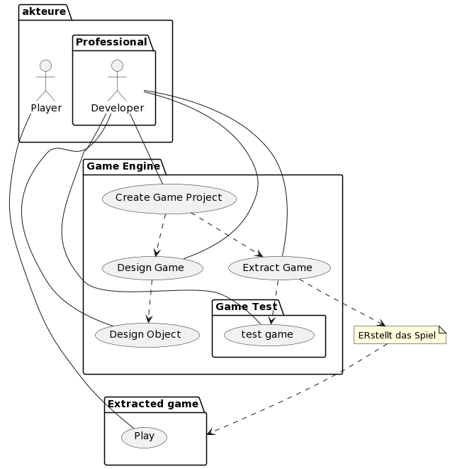
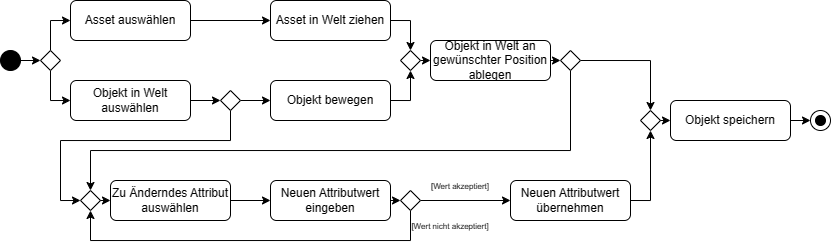
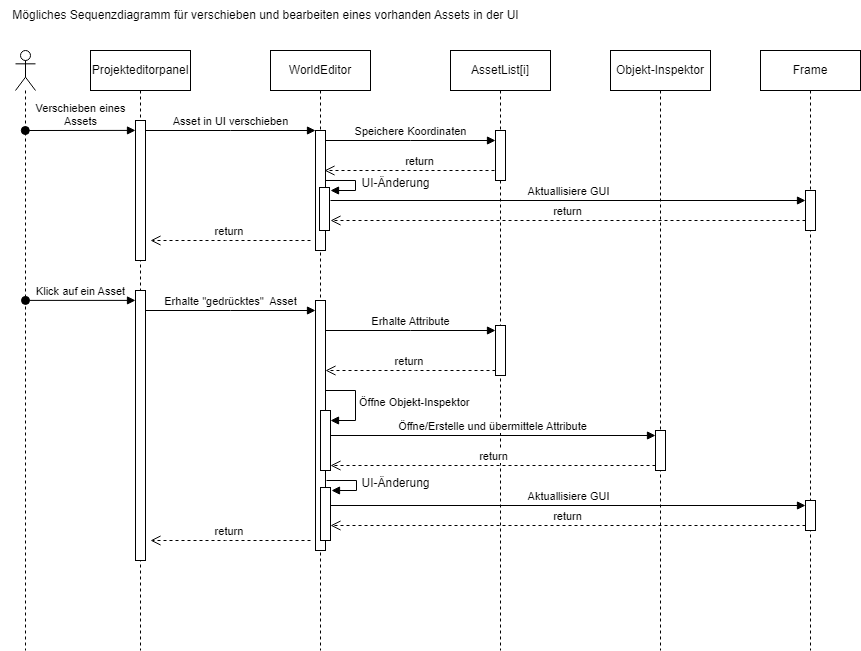
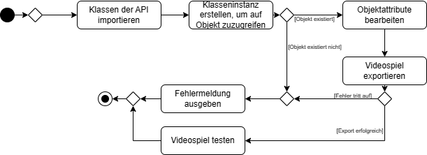
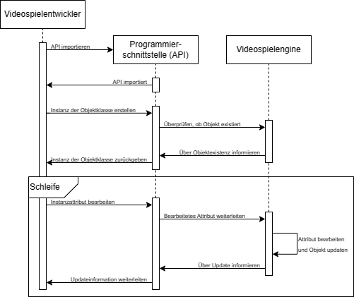
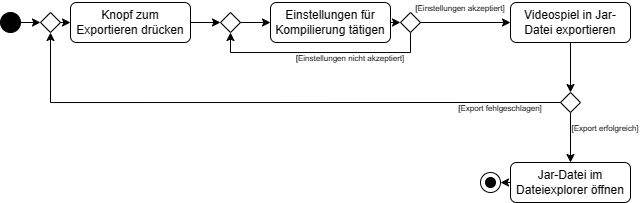

# CrInGE - Softwareanforderungen

## Inhaltsverzeichnis

1. [Einleitung](#1-einleitung)
2. [Funktionale Anforderungen](#2-funktionale-anforderungen)
3. [Nichtfunktionale Anforderungen](#3-nichtfunktionale-anforderungen)
4. [Technische Einschränkungen](#4-technische-einschränkungen)
5. [Glossar](#5-glossar)

## 1. Einleitung

Diese Software Anforderungsspezifikation (SRS) beschreibt alle Spezifikationen für die Anwendung "CrInGE". Dieses Dokument beinhaltet eine Übersicht über das Projekt, sowie dessen Anforderungen.

### 1.1 Übersicht

Um die Entwicklung von zweidimensionalen Videospielen zu erleichtern, soll eine Videospielengine entwickelt werden. Die Anwendung CrInGE beinhaltet einen Editor, welcher sowohl das Zusammenstellen, sowie die Programmierung von Spielwelten ermöglicht. Damit soll die Hürde für interessierte Entwickler gesenkt werden, die zum Einstig in die Videospielentwicklung existiert.

### 1.2 Geltungsbereich

Das Projekt wird als eine Java Swing Anwendung realisiert. Dieses Dokument behandelt diese Anwendung als Ganzes.

Für Subsysteme können zukünftig weitere Software Anforderungsspezifikationen geschrieben werden, wenn dies nötig ist.

In diesem Dokument werden sowohl die funktionalen, als auch die nichtfunktionalen Anforderungen abgedeckt.

Des Weiteren werden keine Anforderungen in andere Dokumente ausgelagert. Hiervon ausgenommen sind Anforderungen, die (wie oben beschrieben) in weiteren Software Anforderungsspezifikationen für Subsysteme dokumentiert werden.

### 1.3 Referenzen

Im Nachfolgenden folgt eine Liste aller Referenzen, die im weiteren Verlauf dieses Dokumentes verwendet werden.

<!-- Bitte beachten: Die Einträge in dieser Tabelle sollen nach dem Veröffentlichungsdatum sortiert werden! -->
Titel | Datum | Veröffentlichungsorganisation | Link
--- | --: | --- | ---
UI-MockUps | 25.10.2023 | CrInGE Entwicklungsteam | [UI-MockUps](./resources/UI%20Mockup)
Anwendungsdiagramm | 25.10.2023 | CrInGE Entwicklungsteam | [Anwendungsfalldiagramm](./resources/UML/Anwendungsfalldiagramm.png)
Aktivitäsdiagramm Welteneditor | 31.10.2023 | CrInGE Entwicklungsteam | [Aktivitäsdiagramm Welteneditor](./resources/UML/Aktivitätsdiagramm_Welteneditor.png)
Aktivitäsdiagramm API | 31.10.2023 | CrInGE Entwicklungsteam | [Aktivitäsdiagramm API](./resources/UML/Aktivitätsdiagramm_API.png)
Aktivitäsdiagramm Exportieren | 31.10.2023 | CrInGE Entwicklungsteam | [Aktivitäsdiagramm Exportieren](./resources/UML/Aktivitätsdiagramm_Exportieren.png)
Sequenzdiagramm Welteneditor | 01.11.2023 | CrInGE Entwicklungsteam | [Sequenzdiagramm Welteneditor](./resources/UML/Sequenzdiagramm_Welteneditor_Class.png)
Sequenzdiagramm API | 01.11.2023 | CrInGE Entwicklungsteam | [Sequenzdiagramm API](./resources/UML/Sequenzdiagramm_API.png)
Architektonisch Relevante Anforderungen (ASR) | 28.11.2023 | CrInGE Entwicklungsteam | [ArchitektonischRelevanteAnforderungen](./ArchitektonischRelevanteAnforderungen.md)

## 2. Funktionale Anforderungen

Dieser Abschnitt beschreibt die verschiedenen funktionalen Anforderungen an die Anwendung.

### 2.1 Übersicht

Die Anwendung ermöglicht dem Benutzer das erstellen von zweidimensionalen Videospielen.

Hierzu ermöglicht die Anwendung dem Benutzer das Zusammenbauen einer Videospielwelt über eine grafische Oberfläche. Darüber kann der Benutzer einzelne Objekte (sogenannte Sprites) in die Welt ziehen. Des Weiteren können für diese Sprites diverse Einstellung, wie beispielsweise das Kollisionsverhalten oder Ähnliches bearbeitet werden.

Darüber Hinaus stellt die Anwendung eine API bereit, über welche das Verhalten der Videospielwelt, sowie diverse Events (beispielsweise Berührungen des Spielers mit Objekten oder Ähnlichem) in der Programmiersprache Java implementiert werden können.

Des Weiteren kann der Benutzer das erstellte Videospiel anschließend in eine Jar-Datei kompilieren und exportieren. Hierdurch wird ermöglicht, dass das Videospiel ohne vorhande Videospielengine auf möglichst vielen Endgeräten problemlos ausgeführt werden kann.

    

### 2.2 Welteneditor

Die Anwendung beinhaltet einen grafischen Welteneditor, welcher dem Benutzer das Zusammenstellen einer Videospielwelt ermöglicht. Hierzu wird die erstellte Videospielwelt im zentralen Bereich des Editors dargestellt.

    

In diesem Welteneditor kann der Benutzer ein bereits existierendes Objekt auswählen. Anschließend kann das gewählte Objekt dann in der Videospielwelt frei bewegt und an einer neuen gewünschten Position abgelegt werden. Des Weiteren kann der Benutzer jederzeit die Attribute des gewählten Objektes im Objektinspektor bearbeiten. Anschließend wird das bearbeitete Objekt gespeichert.

Darüber Hinaus befindet sich in diesem Welteneditor eine Liste an Objekten, die sich in der Videospielwelt befinden, aus welcher der Benutzer beliebige Objekte auswählen und inspizieren kann.

In dem zuvor genannten Objektinspektor kann der Benutzer einige Attribute (bspw. Kollisionsverhalten, Farbe, Textur, Durchsichtigkeit, ID, ...) des jeweils gewählten Objektes bearbeiten. Um derartige Attribute zu bearbeiten, kann der Benutzer das zu Bearbeitende Attribut auswählen und einen neuen Attributwert eingeben. Wenn der eingegebene Attributwert akzeptiert wird, dann wird der neue Attributwert für das Objekt übernommen und gespeichert. Wenn der neue Attributwert nicht akzeptiert wird (dies könnte passieren wenn als Eingabe eine Ganzzahl gewünscht wird und der Benutzer einen Text eingibt), dann wird der vorherige Attributwert wiederhergestellt und der Benutzer muss erneut ein Attribut zur Änderung auswählen.

In einem weiteren Bereich des Welteneditors soll der Benutzer vorgefertigte Formen (bspw. Rechtecke, Dreiecke, Kreise, Lichtquellen, ...) auswählen und in die Videospielwelt ziehen können. Diese vorgefertigte Formen werden als Assets bezeichnet. Hier kann der Benutzer ebenfalls eigene sogenannte Assets erstellen und aufbewahren. Damit solche Assets besser angepasst werden können, soll der Benutzer hier auch die Möglichkeit haben, eigene Texturen hochzuladen.

Zur vereinfachten Darstellung können die obigen Anforderungen dem Sequenzdiagramm (unten) entnommen werden.

    

Diese Anforderung basiert auf den folgenden User Stories:

1. [Als Spieleentwickler möchte ich die Welt, in der mein Spiel stattfindet, durch Drag and Drop zusammenbauen können, damit ich meiner gestalterischen Kreativität freien Lauf lassen kann](https://github.com/users/Christian-2003/projects/2/views/5?pane=issue&itemId=41353628)
2. [Als Spieleentwickler möchte ich das Kollisionsverhalten von Objekten bearbeiten können](https://github.com/users/Christian-2003/projects/2/views/5?pane=issue&itemId=41354086)
3. [Als Spieleentwickler möchte ich eigene Texturen laden können](https://github.com/users/Christian-2003/projects/2/views/5?pane=issue&itemId=42294330)

Der Aufwand für diese Anforderung wird auf **hoch** geschätzt.

    

    

#### 2.2.1 Voraussetzungen

Damit dies möglich ist, muss die Videospielwelt im Backend modelliert und bearbeitet werden können. Dazu müssen wiederrum individuelle Objekte im Backend modelliert und bearbeitet werden können.

Des Weiteren müssen sowohl die Objekte, als auch die Videospielwelt in einem geeigneten Dateiformat gespeichert werden können.

#### 2.2.2 Nachbedingungen

Nachdem die Videospielwelt vom Benutzer erstellt wurde, kann diese über die API programmiert werden. Hierzu muss die API existieren.

### 2.3 Programmierschnittstelle (API)

Die Anwendung ermöglicht dem Benutzer das programmieren des Verhaltens des Videospiels. Hiermit ist bspw. gemeint, dass der Benutzer Events (z.B. Berührung des Spielers mit einem Objekt), Bewegungen von objekten (z.B. Feindliche Kreaturen) oder Ähnliches programmieren kann. Hierzu ist eine API nötig.

Die API ermöglicht dem Benutzer den Zugriff auf alle Objekte in der Videospielwelt. Der Benutzer kann über die API die Attribute sämtlicher Objekte der Videospielwelt bearbeiten.

Darüber Hinaus kann der Benutzer Events registrieren, die dann vom Videospiel während der Ausführung getestet und dann eventuell ausgeführt werden.

Die API wird in Java zur Verfügung gestellt, damit der Benutzer zugriff auf die Umfangreiche Standardbibliothek hat und die Implementation des Benutzers problemlos in das Videospiel integriert werden kann.

    

Um das Prinzip der API besser zu verstehen, soll dies an einem einfachen Beispiel (oben) erläutert werden:

Damit der Benutzer Attributwerte von Objekten in der Videospielwelt bearbeiten kann, muss die APU zuerst importiert werden. Danach kann eine Instanz einer Objekt-Klasse erstellt werden, die dem Benutzer den Zugriff auf ein Objekt der Videospielwelt ermöglicht. Ist das Objekt, auf welches zugegriffen werden soll nicht existent, wird der Benutzer auf diesen Fehler nach dem Exportieren hingewiesen.
Sollte das Objekt existieren, dann kann der Benutzer über die Instanz der Objekt-Klasse dessen Attributwerte bearbeiten.

    

Um die Funktionsweise der API besser zu verstehen, soll das obige Sequenzdiagramm erläutert werden:

Das Sequenzdiagramm beschreibt die Kommunikation zwischen Benutezer (oben Videospielentwickler), Programmierschnittstelle (API) und der Videospielengine. Zuerst muss der Benutzer die API importieren. Anschließend kann der Benutzer eine Instanz der Objektklasse erstellen, um auf Videospielobjekte in der Videospielwelt zuzugreifen. Die API überprüft zunächst über die Videospielengine, ob das erstellte Videospielobjekt in der Videospielwelt existiert. Die Videospielengine informiert die API dann über die Existenz des gewünschten Videospielobjetes. Die API leitet diese Information dann an den Benutzer weiter. Anschließend kann der Benutzer beliebig häufig jeweils ein Attribut des Videospielobjektes bearbeiten. Dazu leitete die API das bearbeitete Attribut and die Videospielengine weiter. Die Videospielengine bearbeitet dann das Attribut und updated bei Bedarf das Videospielobjekt. Anschließend teilt die Videospielengine der API das Update des Videospielobjektes mit. Die API leitet dies an den Benutzer weiter.

Diese Anforderung basiert auf den User Stories:

1. [Als Spieler möchte ich Fähigkeiten meines Charakters leveln können](https://github.com/users/Christian-2003/projects/2/views/5?pane=issue&itemId=41353987)
2. [Als Spieleentwickler möchte ich auf grundlegende physikalische Funktionalitäten der game_editor.controller.Engine zugreifen, sodass ich diese beliebig verwenden kann.](https://github.com/users/Christian-2003/projects/2/views/5?pane=issue&itemId=41354193)
3. [Als Spielentwickler möchte ich Musik/Geräusche zu meinem Spiel hinzufügen, sodass dieses ein immersives Spielerlebnis bieten kann.](https://github.com/users/Christian-2003/projects/2/views/5?pane=issue&itemId=41652124)

Der Aufwand für diese Anforderung wird auf **hoch** geschätzt.

#### 2.3.1 Voraussetzungen

Damit dies möglich ist, muss die Videospielwelt über die grafische Oberfläche programmiert werden können. Darüber Hinaus müssen die Objekte der Videospielwelt im Backend modelliert und bearbeitet werden können.

Zudem muss ein System zum verwalten der vom Benutzer registrierten Events existieren.

#### 2.3.2 Nachbedingungen

N/A

### 2.4. Videospiel exportieren

Damit das Videospiel auf möglichst vielen Endgeräten problemlos ausgeführt werden kann, ohne dass die Videospielengine CrInGE installiert ist, sollen erstellte Videospiele exportiert werden können.

    

Hierzu kann der Benutzer einen Knopf zum Exportieren drücken. Anschließend erlaubt die Videospielengine dem Benutzer, einige Einstellungen zu tätigen, wie beispielsweise die zur Kompilierung zu verwendende Java-Version oder Ähnliches.

Wenn diese Einstellungen nicht akzeptiert werden (bspw. da der Benutzer eine inkorrekte Java-Version angegeben hat), dann wird der Benutzer darauf hingewiesen und kann diese Einstellung erneut bearbeiten.

Wenn alle Einstellungen akzeptiert werden, dann wird das Videospiel als Jar-Datei exportiert. Wenn der Export erfolgreich verläuft, dann wird die exportierte Jar-Datei im Dateiexplorer geöffnet.

Andernfalls wird der Benutzer auf Fehler beim Export hingewiesen und kann das Spiel bei Bedarf erneut exportieren.

Diese Anforderung basiert auf der User Story:

1. [Als Spieleentwickler möchte ich das entwickelte Spiel exportieren können, sodass es einfach von Spielern gespielt werden kann.](https://github.com/users/Christian-2003/projects/2/views/5?pane=issue&itemId=41353971)

Der Aufwand für diese Anforderung wird auf **mittel** geschätzt.

    

#### 2.4.1 Voraussetzungen

Damit das Videospiel exportiert werden kann, muss eine Videospielwelt erstellt und programmiert worden sein.

#### 2.4.2 Nachbedingungen

N/A

### 2.5 Physikengine

Damit der Benutzer möglichst effizient Videospiele entwickeln kann, soll dieser auf grundlegende physikalische Funktionalitäten zurückgreifen können.

Diese physikalischen Funktionalitäten werden über die [API](#23-programmierschnittstelle-api) bereitgestellt.

Zu den funktionalitäten zählen bspw. Das Berechnen von Gravitationskräften oder Flugbahnen.

Diese Anforderung basiert auf der User Story:

1. [Als Spieleentwickler möchte ich auf grundlegende physikalische Funktionalitäten der game_editor.controller.Engine zugreifen, sodass ich diese beliebig verwenden kann.](https://github.com/users/Christian-2003/projects/2/views/5?pane=issue&itemId=41354193)

Der Aufwand für diese Anforderung wird auf **niedrig** geschätzt.

#### 2.5.1 Voraussetzungen

Damit die grundlegenden physikalischen Funktionalitäten verwendet werden können, muss die Videospielwelt (teilweise) erstellt worden und programmierbar sein.

#### 2.5.2 Nachbedingungen

N/A

## 3. Nichtfunktionale Anforderungen

Im Nachfolgenden sollen alle nichtfunktionalen Anforderungen für die Anwendung CrInGE dokumentiert werden.

### 3.1 Benutzerfreundlichkeit

#### 3.1.1 Objektinspektor

Der Objektinspektor realisiert die Bearbeitung der einzelenen Objekte (beschrieben in [2.2 Welteneditor](#22-welteneditor)) und soll als Popup-Fenster realisiert werden. Hierdurch soll verhindert werden, dass der Bearbeitungsbereich für die Videospielwelt verkleinert wird. Des Weiteren soll hierdurch das Gefühl des Entwicklers erleichtert werden.

Diese Anforderung basiert auf folgender User Story:  
[Als Spieleentwickler möchte ich eine möglichst große Weltendarstellung haben, um eine verbesserte Übersicht zu behalten](https://github.com/users/Christian-2003/projects/2/views/5?pane=issue&itemId=42338777)

#### 3.1.2 Objektgruppierung

Im [Welteneditor](#22-welteneditor) sollen Objekte gruppiert werden können, damit verschiedene Einstellungen einheitlich für alle Objekte einer solchen Gruppe getroffen werden können.

Diese Anforderung basiert auf folgender User Story:  
[Als Spieleentwickler möchte ich Blöcke gruppieren können, um deren Eigenschaften gleichzeitig zu bearbeiten](https://github.com/users/Christian-2003/projects/2/views/5?pane=issue&itemId=42294373)

#### 3.1.3 Benutzbarkeot

Der Editor soll benutzbar und benutzerfreundlich gestaltet werden. Damit ist gemeint, dass gängige Tastenkürzel wie beispielsweise `STRG + C`, `STRG + V` oder `STRG + S` verwendet werden und die Menüs in der Menüleiste gängigen Formaten folgen.

Diese Anforderung basiert auf folgender User Story:  
[Als Videospielentwickler möchte ich Videospiele ohne hohen Aufwand erstellen können](https://github.com/users/Christian-2003/projects/2/views/5?pane=issue&itemId=47079880)

### 3.2 Zuverlässigkeit

Sowohl Editor, als auch Engine sollen Logs erstellen, damit Laufzeitfehler dokumentiert werden. Diese Logs sollen dann beim Videospielentwickler und / oder beim CrInGE Entwicklungsteam eingereicht werden können, wenn derartige Laufzeitfehler gemeldet werden. Damit kann der Aufwand zum Finden und Nachstellen von Fehlern seitens der Entwickler reduziert werden, wodurch Fehler schneller behoben werden können.

Diese Anforerung basiert auf folgenden User Stories:  
[Als Videospielentwickler möchte ich, dass Fehler im Quellcode der Engine oder des Editors schnell behoben werden](https://github.com/users/Christian-2003/projects/2/views/5?pane=issue&itemId=47079948) und  
[Als Videospieler möchte ich, dass Fehler im Videospiel schnell behoben werden](https://github.com/users/Christian-2003/projects/2/views/5?pane=issue&itemId=47079958)

### 3.3 Leistung

Die Engine soll lange Ladezeiten verhindern - hiervon ausgenommen sind Initialladezeiten (beispielsweise durch das Laden der Videospielwelt). Damit das Spielerlebnis angenehm ist, soll der Arbeitsspeicher nie mit mehr als 4 GB belastet werden und das Videospiel soll mit mehr als 20 FPS laufen.

Im Editor sollen ebenfalls lange Ladezeiten verhindert werden. Hiervon ausgenommen sind neben Initialladezeiten auch der Export des Spiels. 

Diese Anforderung basiert auf folgenden User Stories:  
[Als Videospieler möchte ich ein möglichst angenehmes Videospielerlebnis haben. Das erstellte Spiel sollte mit modernen Endgeräten mit 20FPS gespielt werden, wobei nicht mehr als 4GB Arbeitsspeicher belastet](https://github.com/users/Christian-2003/projects/2/views/5?pane=issue&itemId=47080088) und  
[Als Videospielentwickler möchte ich, dass das Videospiel effizient und ohne große Wartezeiten entwickelt werden kann. Das Ändern des Videospiels sollte in allen Fällen sofort und ohne Wartezeit geschehen](https://github.com/users/Christian-2003/projects/2/views/5?pane=issue&itemId=47080123)

### 3.4 Wartbarkeit

Um hohen Aufwand durch zukünftige Erweiterungen zu verhinden, soll die Software nach dem _Open-Closed-Prinzip_ entwickelt werden. Dazu ist es notwendig zukünftige Änderungen vorherzusehen. Da dies jedoch nur schwer umzusetzen ist, wird die Software so entwickelt, dass die Anforderungen die in diesem Dokument beschrieben werden, ohne große Probleme zukünftig integriert werden können.

Diese Anforderung basiert auf folgender User Story:  
[Als Kunde möchte ich, dass die Software kostengünstig entwickelt wird](https://github.com/users/Christian-2003/projects/2/views/5?pane=issue&itemId=47080329)

### 3.5 Testbarkeit

Um Softwarefehler frühzeitig zu erkennen und beheben soll die Software Test-Driven entwickelt werden. Dazu sollen für alle Komponenten - soweit möglich - Unit Tests mit JUnit entwickelt werden. Die Software soll insgesamt erst dann kompiliert werden, wenn alle Uni Tests bestanden sind.

Diese Anforderung basiert auf folgender User Story:  
[Als Kunde möchte ich, dass die Software kostengünstig entwickelt wird](https://github.com/users/Christian-2003/projects/2/views/5?pane=issue&itemId=47080329)

<!--
Kategorien: Benutzerfreundlichkeit, Zuverlässigkeit, Leistung, Effizienz, Integrität, Wartbarkeit, Flexibilität, Testbarkeit, Wiederverwendbarkeit, Sicherheit.
-->

## 4. Technische Einschränkungen

Bei dieser Anwendung soll, soweit möglich, auf externe Bibliotheken verzichtet werden. Hiervon ausgenommen ist die Java Standardbibliothek. Des Weiteren behält sich das Entwicklungsteam vor, bei Bedarf und nach gründlicher Ausarbeitung einzelne externe Bibliotheken zu inkludieren, was entsprechend gekennzeichnet wird.

## 5. Glossar

Im Nachfolgenden folgt eine List aller Definitionen, Akronymen und Abkürzungen, die im Weiteren Verlauf dieses Dokumentes verwendet werden.

<!-- Bitte beachten: Die Einträge in dieser Tabelle sollen alphabetisch (nach dem Akronym) sortiert werden! -->
Akronym | Bedeutung
--- | ---
API | Application Programmer Interface (Deutsch: Programmierschnittstelle)
CrInGE | <ins>C</ins>ompute<ins>r</ins>ized <ins>In</ins>tegrated <ins>G</ins>ame <ins>E</ins>ngine
