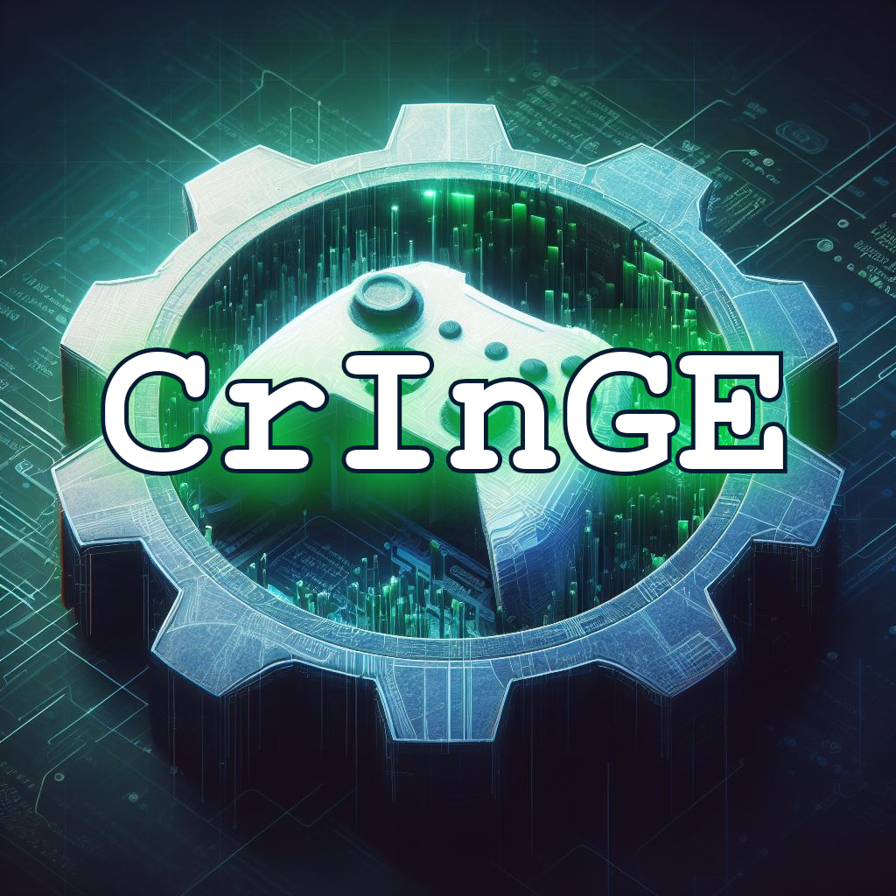

# CrInGE - Software Metriken

Hier werden die drei gewählten Metriken des Projektes hinterlegt.

## Stand zum 14.05.2024

| Metrik | Wert |
| --- | --- |
| Lines of Code | ~ 8.900 |
| Checkstyle Errors | 1.900 |
| Durchschnittliche zyklomatische Komplexität | 11,6 |
| Anzahl Dependencies | 1 |

Dependency ist nur OpenGL

## Endstand

| Metrik | Wert |
| --- | --- |
| Lines of Code | ~ 11.700 |
| Checkstyle Errors | 439 (Stand: 12.06.2024) |
| Durchschnittliche zyklomatische Komplexität | 11,1 |
| Anzahl Dependencies | 1 |

Dependency ist nur OpenGL
